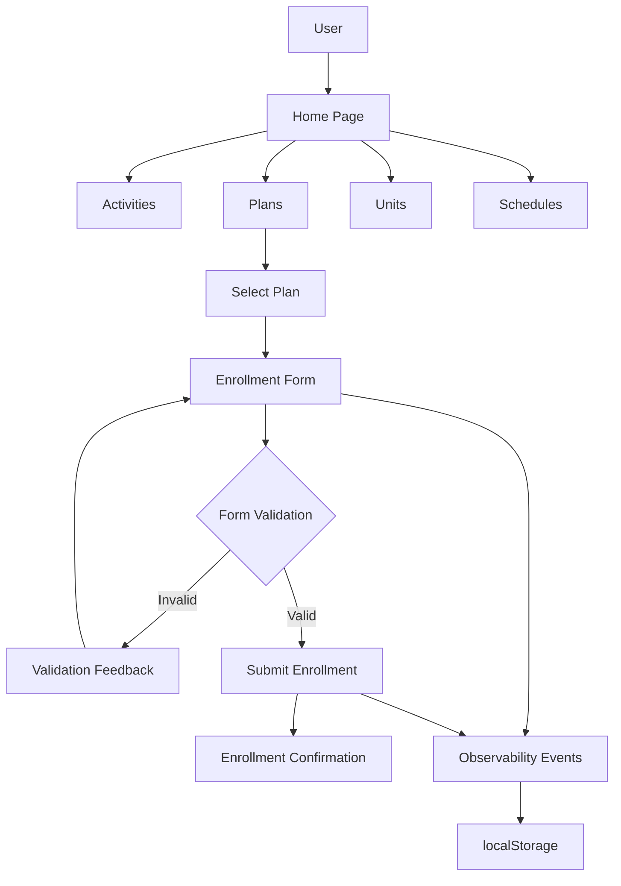
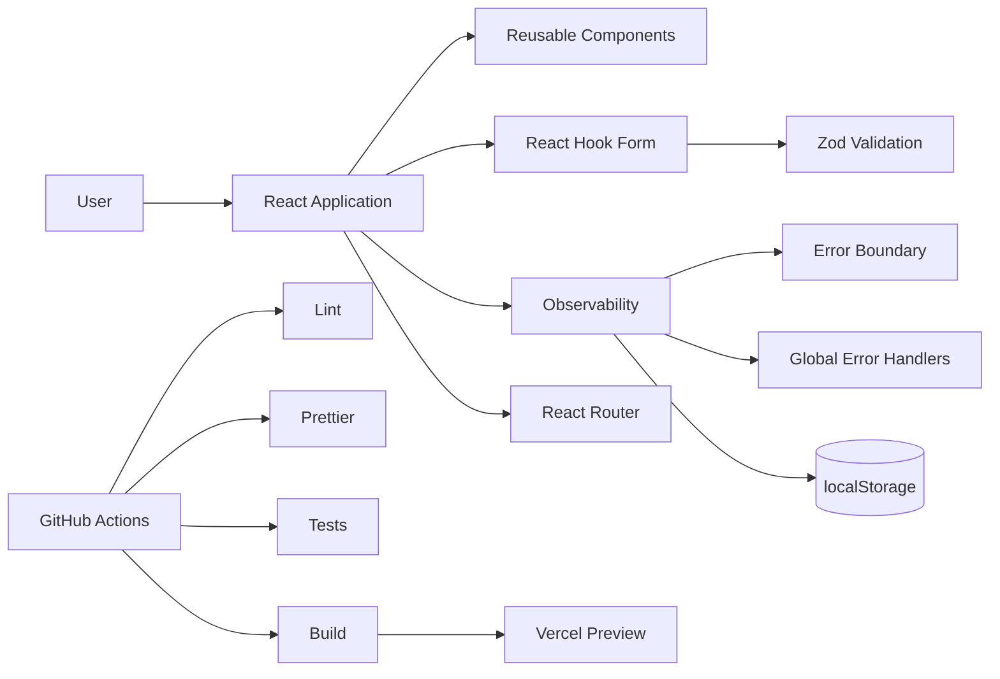
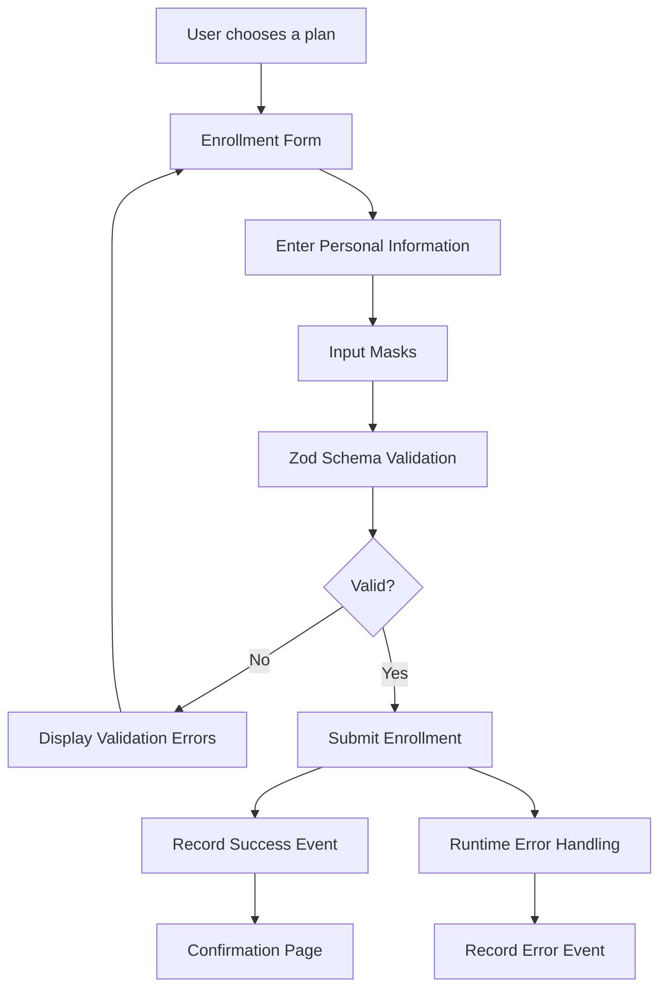
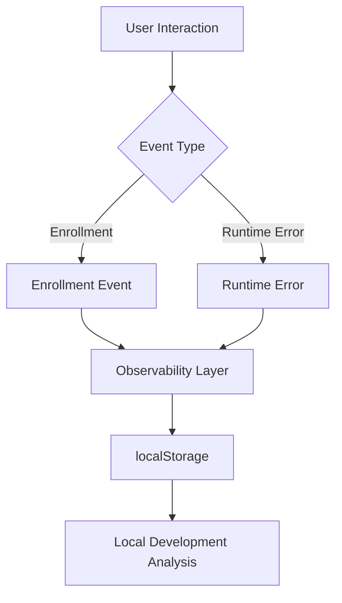
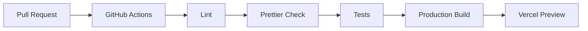

# Technology Gym

> A modern and responsive gym website built with React, TypeScript, Tailwind CSS and Vite, focused on presenting gym plans, activities, units and schedules with a complete online enrollment experience.

---

## Overview

**Technology Gym** is a modern front-end web application designed for a gym environment.

The platform allows users to explore available activities, plans, units and schedules, and complete an online enrollment process through a validated multi-step form.

The project focuses on:

* Modern user experience
* Responsive design
* Reusable components
* Strong form validation
* Runtime error handling
* Local observability
* Automated testing
* CI/CD quality checks

---

## Features

### Gym Information

* Home page
* Activities
* Plans
* Units
* Schedules
* Responsive layouts for desktop, tablet and mobile

### Online Enrollment

* Structured enrollment form
* Field validation
* Input masks
* Real-time validation feedback
* Enrollment success flow
* Invalid submission handling
* Enrollment funnel tracking

### Observability

The application tracks important events locally to help understand user interactions and runtime problems.

Tracked enrollment events include:

* `enrollment_submit_attempt`
* `enrollment_submit_invalid`
* `enrollment_submit_success`
* `enrollment_submit_error`
* `enrollment_stage_interaction`
* `enrollment_abandonment`

Runtime errors are also captured through:

* React Error Boundary
* `window.error`
* `unhandledrejection`

---

## Application Flow



---

## System Architecture



---

## Enrollment Flow

The enrollment process follows a validation-first approach.



---

## Observability Flow



---

## CI/CD Pipeline

Every pull request targeting `main` can go through the project's automated quality pipeline.



### Pipeline checks

* ESLint
* Prettier
* Automated tests
* Production build
* Vercel preview deployment

---

## Tech Stack

| Technology      | Purpose                       |
| --------------- | ----------------------------- |
| React           | UI development                |
| TypeScript      | Static typing                 |
| Tailwind CSS    | Responsive styling            |
| Vite            | Development and build tooling |
| React Hook Form | Form management               |
| Zod             | Schema-based validation       |
| Vitest          | Testing                       |
| GitHub Actions  | CI/CD                         |
| Vercel          | Preview deployment            |

---

## Project Structure

```text
technology_gym/
│
├── .github/
│   └── workflows/
│       └── main.yml
│
├── .husky/
│
├── docs/
│
├── public/
│
├── scripts/
│
├── src/
│   ├── components/
│   ├── pages/
│   ├── hooks/
│   ├── schemas/
│   ├── utils/
│   └── ...
│
├── .gitignore
├── .prettierignore
├── .prettierrc
├── eslint.config.js
├── index.html
├── package.json
├── tsconfig.json
├── vercel.json
├── vite.config.ts
└── vitest.config.js
```

---

## Getting Started

### Prerequisites

Make sure you have the following installed:

* Node.js (LTS recommended)
* npm or Yarn
* Git

### 1. Clone the repository

```bash
git clone https://github.com/anamartinsr/technology_gym.git
```

### 2. Navigate to the project

```bash
cd technology_gym
```

### 3. Install dependencies

```bash
npm install
```

### 4. Start the development server

```bash
npm run dev
```

The application will be available at:

```text
http://localhost:5173
```

---

## Production Build

Create an optimized production build:

```bash
npm run build
```

Preview the production build locally:

```bash
npm run preview
```

---

## Testing

The project includes tests covering important application flows.

### Tested scenarios

* Enrollment page loading
* Complete enrollment form
* Invalid form submission
* Validation error messages
* Successful enrollment
* Confirmation flow
* Non-existent routes / 404 page

Run the test suite with:

```bash
npm run test
```

---

## Code Quality

The project uses automated tooling to maintain code quality and consistency.

### Lint

```bash
npm run lint
```

### Formatting

```bash
npm run format:check
```

### Build

```bash
npm run build
```

---

## Development Principles

The project follows several front-end development practices:

* Reusable and decoupled components
* Strong typing with TypeScript
* Centralized validation with Zod
* Separation of UI and data concerns
* Responsive mobile-first design
* Integration testing for important flows
* Runtime observability
* Automated CI/CD quality checks

---

## Project Goals

The main goals of Technology Gym are to demonstrate:

1. Component-based React development
2. Type-safe front-end architecture
3. Robust form validation
4. Responsive user interfaces
5. Maintainable project structure
6. Automated testing
7. Runtime error observability
8. CI/CD integration

---

## Contribution

Contributions and improvements are welcome.

A typical contribution workflow:

```text
Fork
  ↓
Create Feature Branch
  ↓
Make Changes
  ↓
Run Lint & Tests
  ↓
Commit Changes
  ↓
Push Branch
  ↓
Open Pull Request
```

Example:

```bash
git checkout -b feature/my-improvement

npm install
npm run lint
npm run test
npm run build

git add .
git commit -m "feat: improve enrollment flow"
git push origin feature/my-improvement
```

Then open a Pull Request against the `main` branch.

---

## License

No explicit license is currently specified in the repository.

---

## Project

**Technology Gym**

A modern gym website focused on responsive UI, structured enrollment, validation, observability and automated development workflows.
